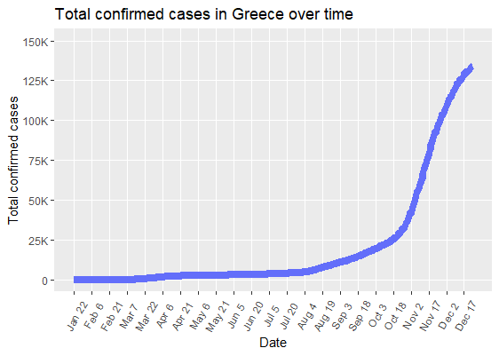
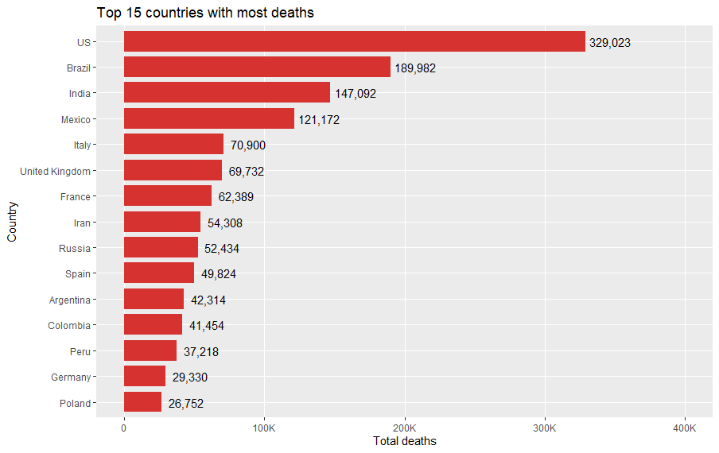

# Covid-19 Exploratory Data Analysis
Project for my MSc course 'Programming tools for data science'. The data used have information about the cumulative [confirmed cases](https://raw.githubusercontent.com/CSSEGISandData/COVID-19/master/csse_covid_19_data/csse_covid_19_time_series/time_series_covid19_confirmed_global.csv) and [number of deaths](https://raw.githubusercontent.com/CSSEGISandData/COVID-19/master/csse_covid_19_data/csse_covid_19_time_series/time_series_covid19_deaths_global.csv) from Covid-19, on different countries and dates.

### Example figures

### Code execution results

